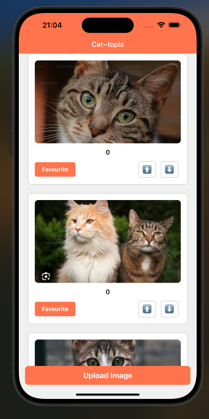
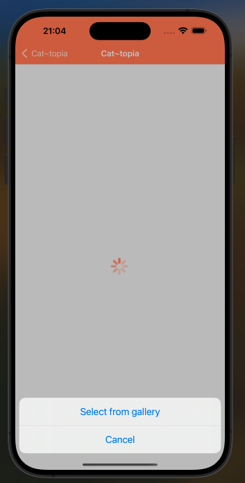
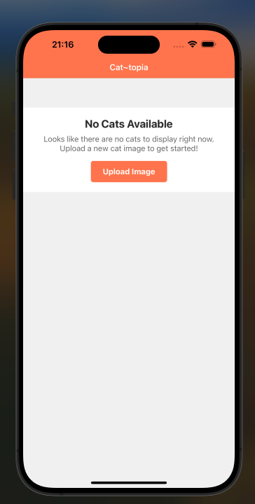
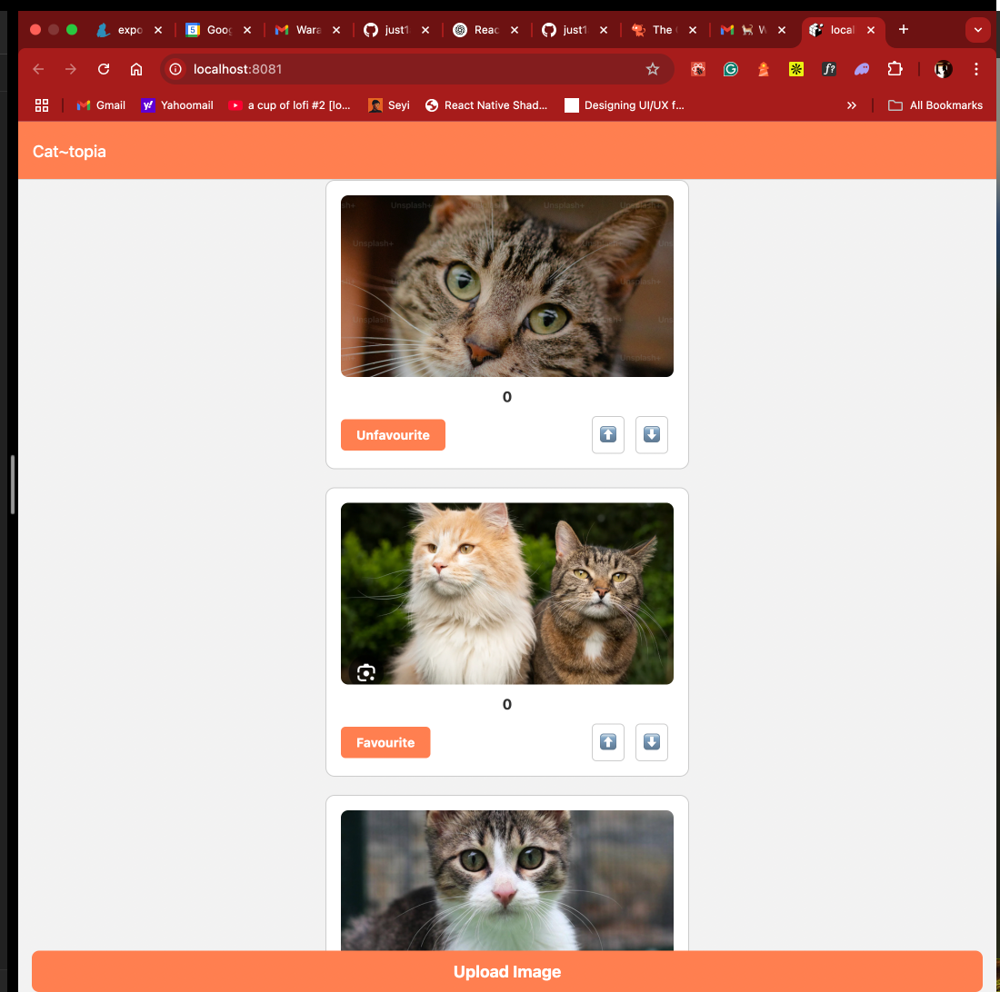

# Cat~topia App

A mobile app built with Expo and React Native that lets users browse, favorite, vote on, and upload cat images using [TheCatAPI](https://thecatapi.com/). Navigation is managed by [Expo Router](https://expo.github.io/router/), making it easy to move between screens.
<p align="center">
  
  
  
</p>
<p align="center">
  
 
</p>

## Overview

This app provides a modern and responsive interface that includes the following features:
- **View Cat Images**: Browse a paginated list of cat images with infinite scrolling.
- **Favorite Cats**: Mark and manage your favorite cat images.
- **Vote on Cats**: Upvote or downvote images to express your preferences.
- **View Score**: See a calculated score for each cat image based on upvotes and downvotes.
- **Upload Images**: Select and upload new cat images from your device.

The app uses:
- **Expo Router** for navigation between screens.
- **React Query** for efficient data fetching and caching.
- **Axios** for API calls.
- **Jest & React Native Testing Library** for testing.

## Installation

1. **Clone the Repository:**

   ```bash
   git clone <repository-url>
   cd <repository-folder>
   ```

2. **Install Dependencies:**

   ```bash
   npm install
   # or
   yarn install
   ```

3. **Configure Environment Variables:**

   Create a `.env` file in the project root and add:

   ```env
   EXPO_PUBLIC_BASE_URL=https://api.thecatapi.com/v1/
   EXPO_PUBLIC_CAT_API_KEY=your_cat_api_key_here
   ```

4. **Start the App:**

   ```bash
   expo start
   ```

## Folder Structure

Using Expo Router, your app structure might look like this:

```
/app
  index.tsx         // HomePage: displays cat images, favorites, votes, and scores.
  upload.tsx        // UploadPage: lets users pick and upload an image.
  
/src
  /api
    api.ts          // API functions for cat images, favorites, and votes.
  /components
    Card.tsx        // Renders individual cat images with voting and favorite controls.
    Spinner.tsx     // A loading spinner component.
  /hooks
    useGetCats.ts       // Custom hook for fetching paginated cat images.
    useFavouriteCats.ts // Custom hook for fetching favorite cat images.
    useCatVotes.ts      // Custom hook for fetching vote data.
  /utils
    utils.ts            // Utility functions (e.g., getCatScore, handleToggleFavourite).
    uploadImage.ts      // Function that handles image uploads.
  README.md
```

## API Functions

All API calls are defined in `src/api/api.ts` using an Axios instance to avoid repetition:

- **fetchUploadedCats(page: number):**  
  Retrieves a paginated list of cat images.

- **fetchFavoriteCats():**  
  Gets the list of favorite cat images.

- **favouriteCat(image_id: string):**  
  Marks a cat image as a favorite.

- **deleteFavouriteCat(favouriteId: number):**  
  Removes a cat image from favorites.

- **fetchCatVotes():**  
  Retrieves vote data for cat images.

- **updateCatVote(image_id: string, value: 1 | 0):**  
  Updates the vote (upvote or downvote) for a cat image.

## Custom Hooks

- **useGetCats:**  
  Uses React Query’s `useInfiniteQuery` to fetch paginated cat images.

- **useFavouriteCats:**  
  Uses React Query’s `useQuery` to fetch favorite cat images.

- **useCatVotes:**  
  Uses React Query’s `useQuery` to fetch vote data.

## Screens

### HomePage (`/app/index.tsx`)

- **Features:**
  - Displays a list of cat images.
  - Allows users to favorite/unfavorite and vote on images.
  - Shows the calculated score (upvotes minus downvotes) for each image.
  - Provides an "Upload" button that navigates to the Upload screen.
  
- **Navigation:**  
  Using Expo Router, the HomePage is the default screen in `/app/index.tsx`.

### UploadPage (`/app/upload.tsx`)

- **Features:**
  - Prompts the user to select an image.
  - Uploads the image using a dedicated utility (`uploadImage.ts`).
  - Navigates back to HomePage upon successful upload or cancellation.

## Uploading Images

Due to limitations with converting file URIs to blobs in Expo, the app uses a workaround in `uploadImage.ts`:  
Instead of converting a URI to a Blob, the app creates a `FormData` object with an object containing the `uri`, a generated filename, and MIME type. This method works on both iOS and Android and avoids crashes.

## Testing

The app includes tests written with Jest and React Native Testing Library. To run the tests:

```bash
npm test
# or
yarn test
```

Tests cover custom hooks, API functions, and UI components (including verifying that navigation works, such as the "Upload" button navigating to the correct screen).

## Known Issues

- **URI to Blob Conversion:**  
  Converting an image URI to a Blob may crash the app. The solution is to directly append the file info (URI, name, type) to `FormData`.

- **Remote JS Debugging:**  
  Debugging with Remote JS enabled can sometimes interfere with file uploads. Disable it if you experience issues.

## Future Improvements

- Add more detailed error logging and user feedback.
- Enhance offline capabilities and caching for improved performance.
- Refine UI animations and transitions based on user feedback.
- **KISS on the upload page:** Simplify the upload screen further to improve usability and maintainability.
- **More tests on the upload screen:** Increase test coverage for the upload functionality to ensure reliability.
- **Improve Web UI:** improve on web design using index.web.tsx

## License

This project is licensed under the MIT License.
